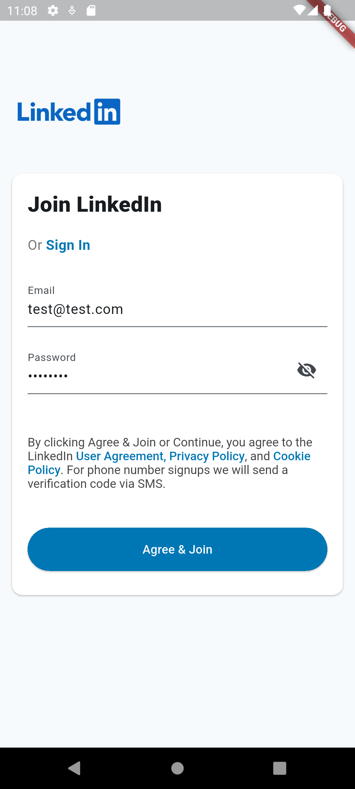

# inkedin_app
A simple Linkedin clone built with Flutter, using the Provider package for state management and following the MVVC (Model-View-ViewController) architectural pattern.

## Screens
- Intro Screen
- Auth Screen (Sign In/ Sign Up)
- Home Screen
- Post View Screen
- Profile Screen

## Features
- Sign in with dummy credentials (email: `test@test.com`, password: `12345678`) or sign up with new credentials
- View posts
- Like and comment on posts
- View profile
  
## Screenshots
 &nbsp;&nbsp;&nbsp;&nbsp;  &nbsp;&nbsp;&nbsp;&nbsp; &nbsp;&nbsp;&nbsp;&nbsp;

 &nbsp;&nbsp;&nbsp;&nbsp;  &nbsp;&nbsp;&nbsp;&nbsp;
